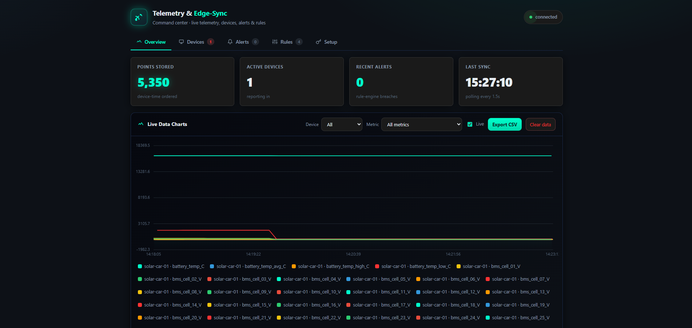
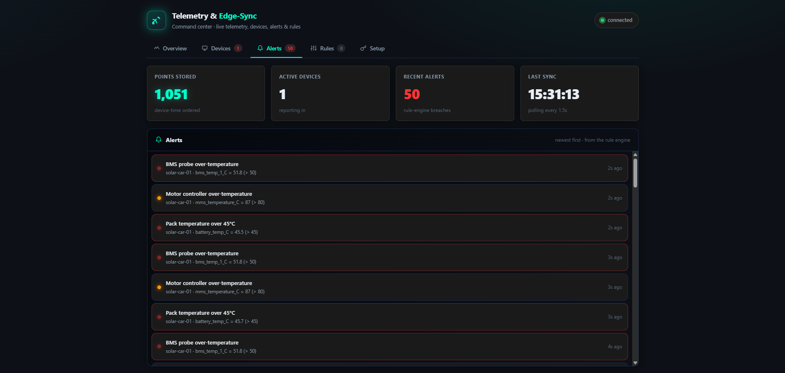
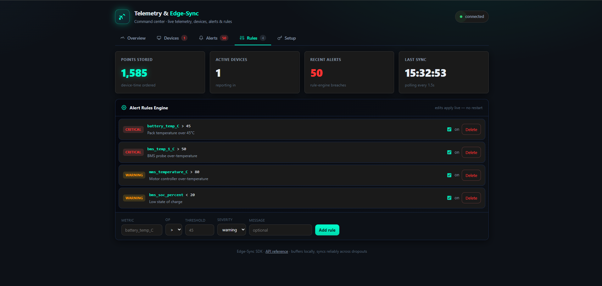
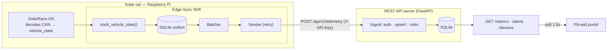
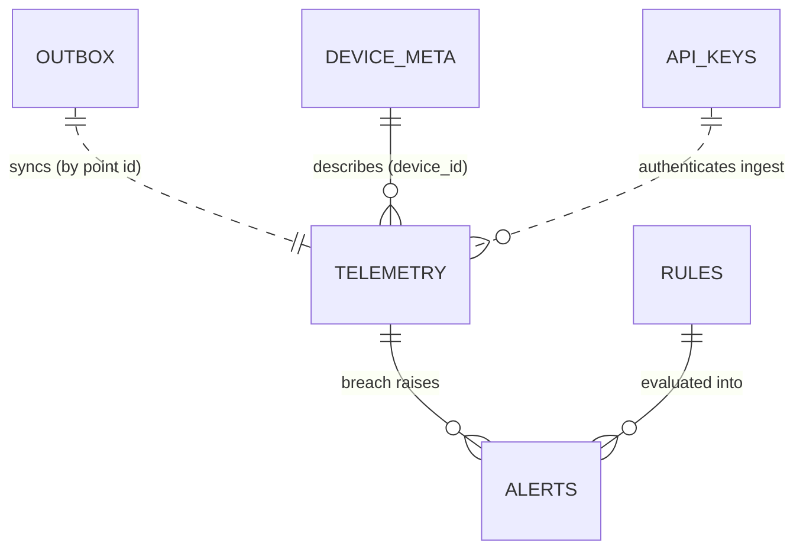
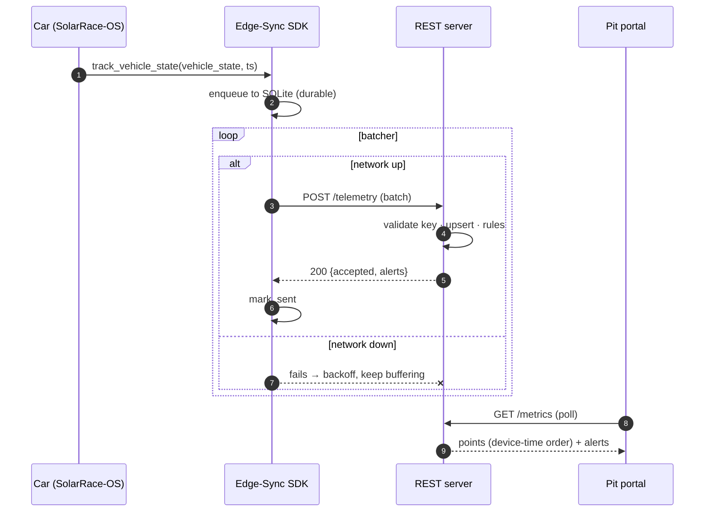
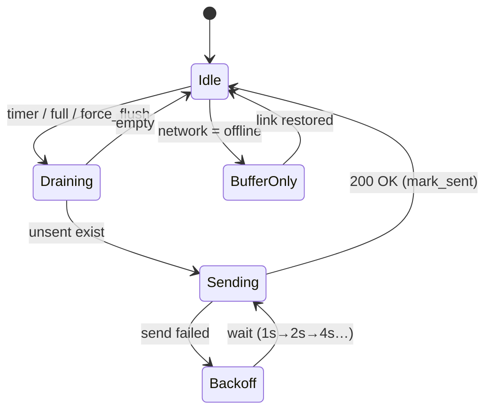

# Telemetry & Edge-Sync SDK

> Resilient telemetry for the **Raspberry Pi on a solar race car** — buffer locally,
> sync reliably across network dropouts, in correct time order, with no duplicates.

## Description

A solar race car generates a constant stream of telemetry (battery management system,
motor controller, battery-temperature controller) on a Raspberry Pi. The car drives
through tunnels, behind grandstands, and across long circuits where the cellular link
drops. A naive "push to the cloud" loses every sample sent during an outage.

This SDK is the fix. On the car it **buffers telemetry to a local SQLite queue first**,
batches it, and syncs it to a REST server — surviving network dropouts *and* reboots.
The pit wall watches a live web portal. The car's software integrates in **three lines**;
the pit crew writes **zero**.

> **The one guarantee:** no data is lost when the car loses signal, and it arrives in
> correct chronological order, with no duplicates.

## Features

- **Durable offline queue** — every reading is written to on-device SQLite *before* any
  send, so dropouts and reboots lose nothing.
- **Smart batching** — many samples per request (by count or time): fewer round-trips,
  less radio/battery cost.
- **Auto-sync recovery** — backlog drains **oldest-first** the moment the link returns.
- **Ordered, idempotent ingestion** — points carry a client-assigned id; the server
  upserts on it, so retries never duplicate. Stored by **device time**, not arrival time.
- **Network-aware sync policy** — batch size & frequency adapt to link type and battery.
- **Server-side alert rule engine** — threshold rules over the car's signals, editable
  live from the portal.
- **API keys** — generate/revoke keys from the dashboard; the SDK can `auto_init()` from
  config or environment.
- **Pit-wall portal** — live charts, device health, alerts, rules editor, device setup.
- **Your own backend** — plain REST to your own server, no vendor lock-in and no cloud
  credentials on the car.

## Screenshots

**Overview — live charts**



**Alerts**



**Rules editor**



## Video

▶ **[Watch the demo walkthrough (58 s)](https://github.com/leerosenblit/Telemetry-Edge-Sync-SDK/issues/1)** — storyboard in [docs/media/SHOTLIST.md](docs/media/SHOTLIST.md).

<!-- To embed an inline PLAYER instead of a link: in issue #1, right-click the video ->
     "Copy link address" to get its asset URL (https://github.com/.../assets/.../….mp4),
     then paste that URL on its own line here, replacing the link line above. -->

---

## Data model (JSON)

A **telemetry point** the SDK produces:

```json
{ "id": "solar-car-01-000042-1718900000123", "metric": "battery_temp_C", "value": 46.2, "ts": 1718900000123 }
```

`id` = `device-sequence-timestamp` (client-assigned → enables idempotent ingestion).
`ts` is the **device** timestamp in epoch ms (the source of truth for ordering).

A **batch** the SDK POSTs (static metadata once, dynamic points many):

```json
{
  "device_id": "solar-car-01",
  "metadata": { "fw": "RaceOS-2.0", "type": "solar-car", "network": "lte" },
  "points": [
    { "id": "solar-car-01-000001-1718900000100", "metric": "bms_voltage_V",   "value": 108.4, "ts": 1718900000100 },
    { "id": "solar-car-01-000002-1718900000101", "metric": "bms_soc_percent", "value": 76.0,  "ts": 1718900000101 }
  ]
}
```

## Database

Server storage is SQLite. The core table (full schema + ERD in
[docs/diagrams.md](docs/diagrams.md)):

```sql
CREATE TABLE telemetry (
  id          TEXT PRIMARY KEY,   -- client-assigned -> idempotent upsert
  device_id   TEXT NOT NULL,
  metric      TEXT NOT NULL,
  value       REAL NOT NULL,
  device_ts   INTEGER NOT NULL,   -- order + late-arrival by device time
  received_ts INTEGER NOT NULL    -- server arrival (diagnostics only)
);
-- sample row:
-- ('solar-car-01-000042-...', 'solar-car-01', 'battery_temp_C', 46.2, 1718900000123, 1718900000130)
```

Other tables: `device_meta` (latest metadata per device), `alerts` (rule breaches),
`rules` (editable alert rules), `api_keys` (issued keys). On the car, the SDK keeps a
durable `outbox` table.

---

## Public functions

What the car's software calls. Full reference + examples in
[docs/sdk-reference.md](docs/sdk-reference.md).

| Function | Purpose |
|---|---|
| `init(server_url, api_key, device_id, **opts)` | Configure the SDK (target, auth, identity, options). |
| `auto_init(config_path=None)` | Configure from a `telemetry.json` file or `TELEMETRY_*` env vars — no hand-coding. |
| `track(metric, value, ts=None)` | Record one data point. Non-blocking, durable. Returns the point id. |
| `force_flush(timeout=15.0)` | Block until the queue drains (e.g. before shutdown). |
| `Client(...)` | The SDK object behind the module API (use directly for multiple devices/instances). |
| `Client.set_link(network=, battery=)` | Update link conditions at runtime; the batcher adapts immediately. |
| `track_vehicle_state(vehicle_state, client=None, ts=None)` | Hand a SolarRace-OS dict to the SDK — tracks every numeric signal. |

```python
from sdk.client import init, track, force_flush
init("https://telemetry.example.com", api_key="<key>", device_id="solar-car-01")
track("battery_temp_C", 46.2)
force_flush()
```

## Internal functions

The implementation behind the guarantee (see [docs/implementation.md](docs/implementation.md)).

| Where | Function | Role |
|---|---|---|
| `sdk/queue.py` | `Queue.enqueue / fetch_unsent / mark_sent` | Durable SQLite outbox; fetch oldest-first; mark sent only after ack. |
| `sdk/client.py` | `_run` | Background batcher loop: flush on timer/nudge, retry with exponential backoff. |
| `sdk/client.py` | `_send_batch / _http_send` | Package points into a batch and POST with `X-API-Key`. |
| `sdk/client.py` | `_apply_policy / _next_id` | Apply network policy; mint the client-assigned point id. |
| `sdk/sync_policy.py` | `plan(network, battery)` | Map link conditions → `(batch_size, flush_interval, allow_send)`. |
| `server/main.py` | `ingest / _valid_key / load_rules` | Auth, idempotent upsert, alert-rule evaluation. |

---

## Diagrams

(Also in [docs/diagrams.md](docs/diagrams.md). Mermaid renders on GitHub.)

### System architecture



### Entity-relationship diagram



> Full table-by-table ERD with columns is in [docs/diagrams.md](docs/diagrams.md).

### Sequence (track → chart, with offline recovery)



### State (the batcher)



---

## Quick start

```bash
pip install -r requirements.txt
```

**Run the server only** (no simulator — use this with a real Pi, and it's exactly what the
cloud runs):

```bash
uvicorn server.main:app --host 0.0.0.0 --port 8000
```

**Or run the all-in-one local demo** (server **+** a simulated solar car + opens the portal —
for trying it out with no hardware):

```bash
python scripts/run.py
```

- **Portal:** http://127.0.0.1:8000/ · **API docs (Swagger):** http://127.0.0.1:8000/docs
- In the portal's **Setup** tab, generate an API key — it shows a ready-to-paste
  `auto_init()` snippet for the car. Full walkthrough: [docs/getting-started.md](docs/getting-started.md).
- To run the server **publicly** (so a remote Pi can reach it), deploy it — see
  [docs/deploy.md](docs/deploy.md).

Resilience demo: while data is streaming, stop and restart the server — the car keeps
buffering and drains the backlog **in order**, nothing lost.

## REST API

| Method & path | Role |
|---|---|
| `POST /api/v1/telemetry` | Ingest a batch (auth `X-API-Key`). Idempotent upsert by point id. |
| `GET /api/v1/metrics?device=&metric=&from=&to=` | Read points, ordered by device time. |
| `GET /api/v1/devices` | Per-device health + latest metadata. |
| `GET /api/v1/alerts?device=&limit=` | Recent alerts. |
| `GET/POST/PATCH/DELETE /api/v1/rules` | Manage alert rules. |
| `GET/POST/DELETE /api/v1/keys` | Issue / list / revoke API keys. |

Full reference: [docs/rest-api.md](docs/rest-api.md).

## Documentation

Full docs live in **[`docs/`](docs/)** (the permalink once pushed to GitHub):
[index](docs/index.md) · [use cases](docs/use-cases.md) · [features](docs/features.md) ·
[getting started](docs/getting-started.md) · [SDK reference](docs/sdk-reference.md) ·
[user init & API keys](docs/user-init.md) · [dashboard](docs/dashboard.md) ·
[implementation](docs/implementation.md) · [REST API](docs/rest-api.md) ·
[diagrams](docs/diagrams.md) · [cloud deploy](docs/deploy.md).

## Deploying to the cloud

To run the server publicly so a remote Pi (on cellular) can reach it, deploy to Render with
the included [`render.yaml`](render.yaml) / [`Procfile`](Procfile) — full walkthrough in
[docs/deploy.md](docs/deploy.md).

## Project layout

```
sdk/              edge SDK: client (queue→batch→retry), durable queue, sync policy, auto_init
  integrations/   solar-car bridge — solar_race.py (vehicle_state → track) + simulator
server/           FastAPI REST API + alert rule engine + API keys, serves the portal
dashboard/        single-page command-center portal (no build step, no CDN)
docs/             the documentation set (architecture, deploy, API reference, diagrams, …)
examples/         runnable demo.py + the telemetry.json config template
scripts/          run.py — one-command launcher (server + simulated solar car)
tests/            test suite + shared conftest fixtures
pyproject.toml · requirements.txt        project config + dependencies
Procfile · render.yaml · runtime.txt     cloud-deploy config (Render)
```

## Testing

```bash
pytest
```

Covers the core guarantees: no-loss across a network drop, idempotency on lost
acknowledgements, data survival across a process restart, the alert rule engine, the
network-aware sync policy, API-key validation, and `auto_init`.

## Design & scope

- [docs/architecture.md](docs/architecture.md) — full design and key engineering decisions.
- [docs/future-work.md](docs/future-work.md) — what's deferred (TSDB, message broker, Protobuf,
  WebSocket push, multi-car fleet) and why, with the path to add each.
