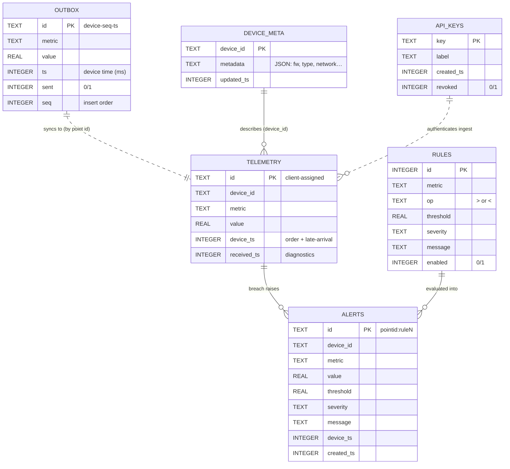
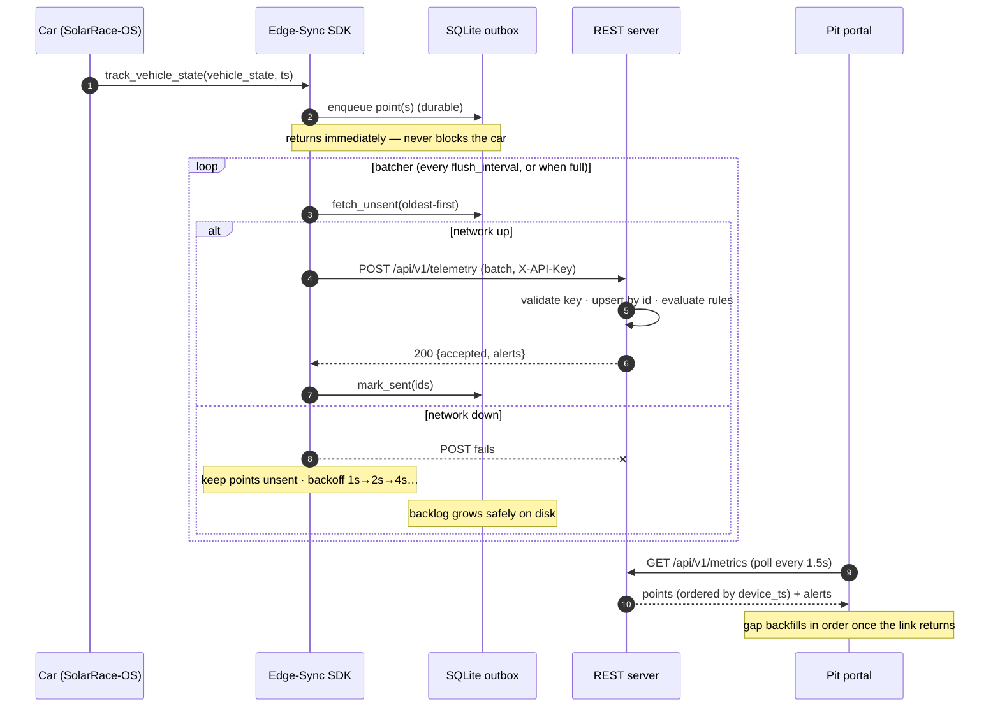
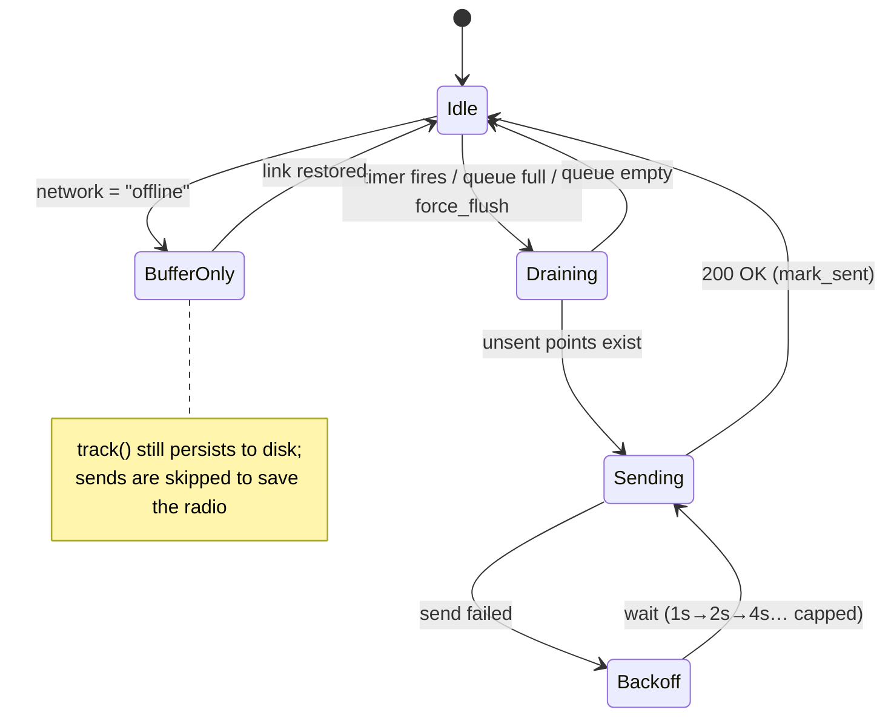

# Diagrams

All diagrams are [Mermaid](https://mermaid.js.org/) — they render automatically on
GitHub and in most Markdown viewers (VS Code: "Markdown Preview Mermaid Support").

## System architecture

How telemetry flows from the car to the pit wall.

```mermaid
flowchart LR
    subgraph CAR["Solar car — Raspberry Pi"]
        CAN["CAN bus<br/>BMS · MMS · battery-temp"] --> OS["SolarRace-OS<br/>decodes → vehicle_state"]
        OS --> BRIDGE["track_vehicle_state()"]
        subgraph SDK["Edge-Sync SDK"]
            BRIDGE --> Q[("SQLite outbox<br/>durable queue")]
            Q --> BATCH["Batcher<br/>(count / time)"]
            BATCH --> SEND["Sender<br/>retry + backoff"]
        end
    end

    SEND -- "HTTPS POST /api/v1/telemetry<br/>(batch, X-API-Key)" --> API

    subgraph SERVER["REST API server (FastAPI)"]
        API["Ingest<br/>auth · upsert · rules"] --> DB[("SQLite<br/>telemetry · alerts · …")]
    end

    DB --> READ["GET /api/v1/metrics · /alerts · /devices"]
    READ -- "poll every 1.5s" --> PORTAL["Pit-wall portal<br/>charts · devices · alerts · rules · setup"]

    style SDK fill:#0e1b1a,stroke:#2dd4bf
    style SERVER fill:#0e1422,stroke:#5b8cff
```

## Entity-relationship diagram (ERD)

The server's SQLite store (plus the SDK's on-device outbox). The car-assigned
point `id` is the idempotency key; alert ids are derived from it.

## Sequence — track to chart (with offline recovery)

## State — the batcher

